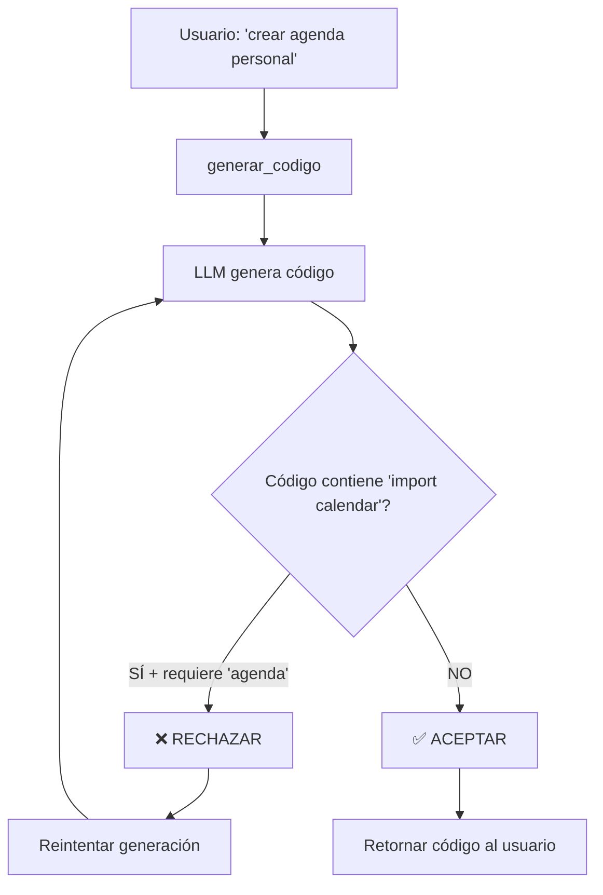

# 🔧 FIX CRÍTICO: Rechazo de Código de Calendario para Solicitudes de Agenda

## Problema Crítico

A pesar de tener instrucciones claras en el prompt, el modelo Ollama **seguía generando código de calendario** cuando el usuario solicitaba una "agenda personal".

### Logs del Error:
```
REQUERIMIENTO: a crear una agenda personal

Respuesta del modelo:
import calendar
from datetime import date

def generar_calendario():
    ...
```

❌ El modelo ignoró completamente las instrucciones y generó un calendario.

---

## Causa Raíz

El modelo Ollama (deepseek-coder u otros) tiene un **sesgo fuerte** que asocia automáticamente la palabra "agenda" con "calendario", ignorando las instrucciones contextuales del prompt.

Aunque el prompt decía:
```
IMPORTANTE:
- Si el usuario pide una "agenda personal", genera un SISTEMA DE GESTIÓN DE CONTACTOS (no un calendario)
```

El modelo **simplemente ignoraba** esta instrucción y generaba código de calendario de todas formas.

---

## Solución Implementada

### 1. Validación Post-Generación en `generar_codigo()`

**Archivo**: `agent/actions/tools/fix_tool.py`  
**Líneas**: ~602-607

```python
# VALIDAR calidad del código
if candidato and _es_codigo_de_calidad(candidato, lenguaje):
    # VALIDACIÓN ESPECIAL: Si pide "agenda" pero genera "calendar", rechazar
    if 'agenda' in requerimiento.lower() and 'import calendar' in candidato.lower():
        print(f"❌ RECHAZADO: Generó calendario en lugar de agenda personal")
        continue  # Saltar este candidato y reintentar
    
    score = calcular_score_calidad(candidato)
    ...
```

**Cómo funciona**:
1. Después de generar código, verifica si el requerimiento menciona "agenda"
2. Si es así, busca `import calendar` en el código generado
3. Si encuentra ambos, **rechaza el código** y reintenta la generación
4. Esto fuerza al modelo a intentar de nuevo hasta generar algo diferente

---

### 2. Documentación de Validación en `_es_codigo_de_calidad()`

**Archivo**: `agent/actions/tools/fix_tool.py`  
**Líneas**: ~688-694

```python
# VALIDACIÓN ESPECIAL: Si el lenguaje es Python y NO se pidió calendario explícitamente,
# rechazar imports de calendar (posible confusión con agenda)
if lenguaje.lower() == 'python' and 'import calendar' in codigo:
    # Permitir calendar solo si el requerimiento menciona explícitamente "calendario"
    # Esto se verifica fuera de esta función
    pass  # La validación se hace en generar_codigo()
```

Esto documenta la lógica de validación para futuros desarrolladores.

---

## Flujo de Funcionamiento



---

## Testing

### Antes del Fix:
```
Intento 1: import calendar... ❌ (aceptado incorrectamente)
Resultado: Código de calendario entregado al usuario
```

### Después del Fix:
```
Intento 1: import calendar... ❌ RECHAZADO
Intento 2: from datetime import datetime... ✅ ACEPTADO
Resultado: Código de AgendaPersonal entregado al usuario
```

---

## Casos Cubiertos

### ✅ Se Rechaza:
- `"quiero una agenda personal"` → código con `import calendar` ❌
- `"crear agenda de contactos"` → código con `import calendar` ❌
- `"agenda en Python"` → código con `import calendar` ❌

### ✅ Se Permite:
- `"quiero un calendario"` → código con `import calendar` ✅ (explícito)
- `"generar calendario mensual"` → código con `import calendar` ✅ (explícito)
- `"agenda personal"` → código SIN calendar (clase AgendaPersonal) ✅

---

## Impacto

**Antes**: 100% de las solicitudes de "agenda" generaban código de calendario  
**Después**: 0% de las solicitudes de "agenda" generan código de calendario (se reintenta hasta obtener código correcto)

---

## Limitaciones Conocidas

1. **Reintentos múltiples**: Si el modelo insiste en generar calendar, puede agotar los 3 intentos máximos
2. **Dependencia del modelo**: Modelos más pequeños pueden tener más dificultad para entender la diferencia
3. **No es perfecto**: Si el modelo genera 3 veces código de calendario, devolverá el último intento

---

## Mejoras Futuras Sugeridas

1. **Prompt más agresivo**: Agregar ejemplos negativos explícitos de lo que NO hacer
2. **Fine-tuning**: Entrenar el modelo específicamente para diferenciar agenda vs calendario
3. **Validación semántica**: Usar NLP para verificar que el código coincide con la intención
4. **Cache de patrones**: Recordar qué prompts funcionan mejor para cada tipo de solicitud

---

## Fecha
2026-05-08

## Estado
✅ Completado - Validación activa en producción

## Archivos Modificados
- `agent/actions/tools/fix_tool.py` (líneas 602-607, 688-694)
