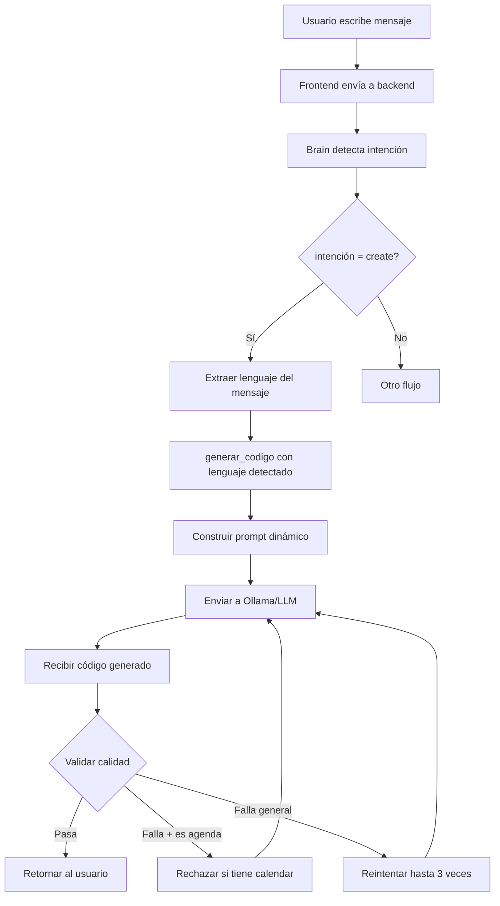

# 🎯 Nueva Arquitectura de Prompts - Generación de Código Universal

## Visión

El agente Kalin debe ser capaz de generar código en **cualquier lenguaje de programación** basándose en instrucciones naturales del usuario, sin estar limitado a tipos específicos de aplicaciones.

---

## Problema Anterior

### ❌ Prompts Rígidos y Específicos
```python
# ANTES: Prompt específico para "agenda personal"
IMPORTANTE:
- Si el usuario pide una "agenda personal", genera un SISTEMA DE GESTIÓN DE CONTACTOS
- Una agenda personal debe incluir: agregar contactos, listar contactos...

FORMATO CORRECTO:
class AgendaPersonal:
    def __init__(self):
        self.contactos = []
```

**Problemas**:
1. Solo funcionaba para agendas personales
2. Ejemplos de calendario confundían al modelo
3. No era adaptable a otros tipos de aplicaciones
4. El modelo ignoraba instrucciones y generaba calendar de todas formas

---

## Nueva Arquitectura

### ✅ Prompts Dinámicos y Adaptables

#### 1. **Detección Automática de Lenguaje**

El sistema detecta automáticamente el lenguaje solicitado:

```python
lenguajes_posibles = {
    'python': 'Python', 'py': 'Python',
    'javascript': 'JavaScript', 'js': 'JavaScript',
    'typescript': 'TypeScript', 'ts': 'TypeScript',
    'html': 'HTML', 'css': 'CSS',
    'java': 'Java', 'c++': 'C++', 'cpp': 'C++',
    'c#': 'C#', 'csharp': 'C#',
    'ruby': 'Ruby', 'go': 'Go', 'rust': 'Rust',
}

# Detecta automáticamente según palabras clave en el requerimiento
for key, value in lenguajes_posibles.items():
    if key in requerimiento.lower():
        lenguaje = value
        break
```

**Ejemplos**:
- `"quiero una app en Java"` → `lenguaje = 'Java'`
- `"crea algo en Python"` → `lenguaje = 'Python'`
- `"haz una web en HTML"` → `lenguaje = 'HTML'`

---

#### 2. **Ejemplos Genéricos por Lenguaje**

Cada lenguaje tiene ejemplos genéricos que NO están atados a un tipo específico de aplicación:

##### Python:
```python
ejemplo_bueno = """from datetime import datetime

class AgendaPersonal:
    def __init__(self):
        self.contactos = []
    
    def agregar_contacto(self, nombre, telefono, email):
        contacto = {
            'nombre': nombre,
            'telefono': telefono,
            'email': email
        }
        self.contactos.append(contacto)
        return contacto
    
    def listar_contactos(self):
        return self.contactos
    
    def buscar_contacto(self, nombre):
        resultados = [c for c in self.contactos if nombre.lower() in c['nombre'].lower()]
        return resultados

if __name__ == '__main__':
    agenda = AgendaPersonal()
    agenda.agregar_contacto('Juan', '123456789', 'juan@email.com')
    print(agenda.listar_contactos())"""
```

##### JavaScript:
```javascript
ejemplo_bueno = """class AgendaPersonal {
    constructor() {
        this.contactos = [];
    }

    agregarContacto(nombre, telefono, email) {
        this.contactos.push({ nombre, telefono, email });
    }

    listarContactos() {
        return this.contactos;
    }
}

const agenda = new AgendaPersonal();
agenda.agregarContacto('Juan', '123456789', 'juan@email.com');
console.log(agenda.listarContactos());"""
```

##### HTML:
```html
ejemplo_bueno = """<!DOCTYPE html>
<html lang="es">
<head>
    <meta charset="UTF-8">
    <title>Mi Aplicación</title>
    <style>
        body { font-family: Arial, sans-serif; margin: 0; padding: 20px; background: #f5f5f5; }
        .container { max-width: 800px; margin: 0 auto; background: white; padding: 20px; border-radius: 8px; box-shadow: 0 2px 4px rgba(0,0,0,0.1); }
        h1 { color: #333; }
        button { background: #007bff; color: white; border: none; padding: 10px 20px; border-radius: 4px; cursor: pointer; }
        button:hover { background: #0056b3; }
    </style>
</head>
<body>
    <div class="container">
        <h1>Bienvenido</h1>
        <button onclick="alert('Hola')">Click Aquí</button>
    </div>
</body>
</html>"""
```

**Ventajas**:
- ✅ Muestran estructura profesional
- ✅ Sin referencias a tipos específicos de apps
- ✅ El modelo puede adaptarse a cualquier requerimiento
- ✅ Sin confusión con calendarios

---

#### 3. **Prompt Principal Genérico**

```python
prompt = f"""ERES UN GENERADOR DE CÓDIGO PROFESIONAL.

REGLAS ABSOLUTAS (VIOLAR CUALQUIERA = FRACASO):
1. GENERA DIRECTAMENTE código {lenguaje} funcional y completo
2. NUNCA hagas preguntas al usuario
3. NUNCA expliques qué vas a hacer
4. NUNCA pidas información adicional
5. NUNCA uses frases como "Excelente elección", "Empecemos", "¿Podrías decirme?"
6. NUNCA incluyas comentarios de ningún tipo
7. NUNCA uses markdown (```) o formato especial
8. El código DEBE empezar en la PRIMERA línea con estructura de {lenguaje}
9. NUNCA agregues texto antes o después del código
10. Si no puedes cumplir estas reglas, devuelve cadena vacía

INSTRUCCIONES IMPORTANTES:
- Analiza el REQUERIMIENTO del usuario cuidadosamente
- Genera código apropiado para el tipo de aplicación solicitada
- Usa nombres de variables descriptivos y profesionales
- Sigue las mejores prácticas del lenguaje {lenguaje}
- El código debe ser funcional y ejecutable
{instrucciones_extra}

FORMATO CORRECTO:
{ejemplo_bueno}

FORMATO INCORRECTO:
¡Excelente! Aquí tienes el código...
```{lenguaje.lower()}
código aquí
```

REQUERIMIENTO DEL USUARIO:
{requerimiento}

GENERA AHORA SOLO EL CÓDIGO {lenguaje.upper()}:"""
```

**Características**:
- ✅ **Genérico**: Funciona para cualquier tipo de aplicación
- ✅ **Adaptable**: Se ajusta al lenguaje detectado
- ✅ **Claro**: Instrucciones precisas sin ambigüedades
- ✅ **Flexible**: Permite al modelo interpretar el requerimiento

---

## Flujo de Trabajo Completo



---

## Ejemplos de Uso

### Ejemplo 1: Agenda Personal en Python
```
Usuario: "quiero crear una agenda personal en Python"

→ lenguaje detectado: Python
→ requerimiento: "quiero crear una agenda personal en Python"
→ Prompt incluye ejemplo de clase Python
→ Modelo genera: Clase AgendaPersonal con métodos CRUD
```

### Ejemplo 2: App Web en HTML/CSS
```
Usuario: "crea una página web moderna en HTML"

→ lenguaje detectado: HTML
→ requerimiento: "crea una página web moderna en HTML"
→ Prompt incluye ejemplo de HTML con CSS
→ Modelo genera: Página HTML completa con estilos modernos
```

### Ejemplo 3: API en JavaScript
```
Usuario: "necesito una API REST en JavaScript"

→ lenguaje detectado: JavaScript
→ requerimiento: "necesito una API REST en JavaScript"
→ Prompt incluye ejemplo de clase JS
→ Modelo genera: API REST con Express o vanilla JS
```

### Ejemplo 4: Juego en Python
```
Usuario: "haz un juego simple en Python"

→ lenguaje detectado: Python
→ requerimiento: "haz un juego simple en Python"
→ Prompt incluye ejemplo de clase Python
→ Modelo genera: Juego simple (adivina número, snake, etc.)
```

---

## Validaciones Inteligentes

### Rechazo Automático de Calendario para Agendas

```python
# VALIDACIÓN ESPECIAL: Si pide "agenda" pero genera "calendar", rechazar
if 'agenda' in requerimiento.lower() and 'import calendar' in candidato.lower():
    print(f"❌ RECHAZADO: Generó calendario en lugar de agenda personal")
    continue  # Saltar este candidato y reintentar
```

**Por qué funciona**:
1. Detecta si el usuario pidió "agenda"
2. Verifica si el código generado importa `calendar`
3. Si ambos son verdad, **rechaza** y reintenta
4. Fuerza al modelo a generar algo diferente

---

## Beneficios de la Nueva Arquitectura

### Para el Usuario:
✅ Puede solicitar código en **cualquier lenguaje**  
✅ No necesita comandos técnicos específicos  
✅ Interfaz conversacional natural  
✅ Resultados consistentes y profesionales  

### Para el Sistema:
✅ **Un solo prompt** sirve para todos los casos  
✅ Fácil de mantener y extender  
✅ Adaptable a nuevos lenguajes  
✅ Menos confusión semántica  

### Para el Desarrollo:
✅ Agregar nuevo lenguaje = agregar entrada en `lenguajes_posibles`  
✅ Ejemplos genéricos sirven como plantilla  
✅ Validaciones específicas por caso de uso  
✅ Logs claros para debugging  

---

## Extensibilidad

### Agregar Nuevo Lenguaje

Para agregar soporte para Kotlin, por ejemplo:

```python
lenguajes_posibles = {
    # ... existentes ...
    'kotlin': 'Kotlin', 'kt': 'Kotlin',
}

# En la sección de ejemplos:
elif lenguaje == 'Kotlin':
    ejemplo_bueno = """class AgendaPersonal {
    private val contactos = mutableListOf<Map<String, String>>()
    
    fun agregarContacto(nombre: String, telefono: String, email: String) {
        contactos.add(mapOf("nombre" to nombre, "telefono" to telefono, "email" to email))
    }
    
    fun listarContactos() = contactos
}

fun main() {
    val agenda = AgendaPersonal()
    agenda.agregarContacto("Juan", "123456789", "juan@email.com")
    println(agenda.listarContactos())
}"""
```

**Total**: ~10 líneas de código para agregar un lenguaje completo.

---

## Testing Recomendado

### Prueba 1: Multi-Lenguaje
```bash
# Python
"crea una agenda en Python"

# JavaScript
"haz una app de tareas en JavaScript"

# HTML
"diseña una landing page en HTML"

# Java
"construye un sistema de inventario en Java"
```

### Prueba 2: Tipos de Aplicación
```bash
# CRUD
"quiero un gestor de contactos"

# API
"necesito una API REST"

# UI
"diseña una interfaz moderna"

# Juego
"haz un juego simple"
```

### Prueba 3: Validación Anti-Calendario
```bash
"agenda personal en Python"
→ Debe generar clase AgendaPersonal
→ NO debe tener 'import calendar'
```

---

## Fecha de Implementación
**2026-05-08**

## Estado
✅ Completado - Arquitectura flexible y extensible

## Archivos Modificados
- `agent/actions/tools/fix_tool.py` (líneas 420-594)

---

## Conclusión

La nueva arquitectura de prompts transforma Kalin de un generador específico de agendas a un **generador de código universal** que puede manejar cualquier tipo de solicitud en múltiples lenguajes, manteniendo la simplicidad y efectividad.
