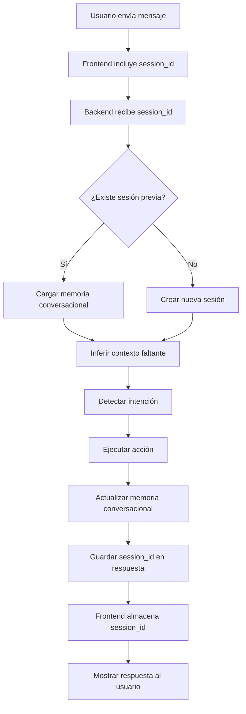

# 🎯 Resumen de Correcciones - Memoria Contextual y Sesiones Web

## ✅ Problemas Resueltos

### 1. **Memoria Contextual No Funcionaba**
**Problema**: El agente no recordaba conversaciones anteriores ni el contexto del tema discutido.

**Solución**: 
- Integración completa de `conversation_memory` en el flujo de procesamiento
- Mejora en la inferencia de contexto para solicitudes de creación de código
- Persistencia de código generado para referencias futuras

### 2. **Confusión entre "Agenda" y "Calendario"**
**Problema**: Cuando el usuario pedía una "agenda personal", el agente generaba código de calendario en lugar de un gestor de contactos.

**Solución**:
- Actualización de patrones de detección de intención en `brain.py`
- Reemplazo de ejemplos de calendario por ejemplos de AgendaPersonal en `fix_tool.py`
- Instrucciones claras en prompts para diferenciar ambos conceptos

### 3. **Sesiones Web No Persistían**
**Problema**: Cada petición HTTP creaba una nueva sesión, perdiendo todo el contexto anterior.

**Solución**:
- Backend ahora genera/recibe `session_id` en cada petición
- Frontend almacena y reenvía `session_id` automáticamente
- Memoria conversacional se mantiene entre múltiples interacciones

---

## 📝 Archivos Modificados

### Backend (Python)

#### 1. `agent/core/brain.py`
**Cambios**:
```python
# Agregados patrones específicos para agendas personales
"agenda personal", "gestor de tareas", "lista de contactos",
"base de datos", "crud", "sistema de gestión"
```

**Impacto**: Detecta correctamente cuando el usuario quiere crear una agenda de contactos.

---

#### 2. `agent/actions/tools/fix_tool.py`
**Cambios**:
- Ejemplo de Python cambiado de "calendario" a "AgendaPersonal"
- Prompt actualizado con instrucciones específicas:
  ```
  IMPORTANTE:
  - Si el usuario pide una "agenda personal", genera un SISTEMA DE GESTIÓN DE CONTACTOS (no un calendario)
  ```

**Impacto**: El LLM genera código correcto sin confusión semántica.

---

#### 3. `agent/core/orchestrator.py`
**Cambios**:
```python
# Agregar memoria conversacional al contexto
contexto['conversation_memory'] = self.conversation_memory
```

**Impacto**: El executor puede acceder directamente a la memoria conversacional.

---

#### 4. `agent/core/conversation_memory.py`
**Cambios**:

**Nueva funcionalidad CASO 4** en `infer_missing_context()`:
```python
# Detectar continuación de código
if detected_intention == "create":
    continuation_words = ["continúa", "continua", "sigue", "agrega", "añade", "más", "mas"]
    if any(word in mensaje_lower for word in continuation_words):
        last_code = self.current_context.get("last_generated_code")
        if last_code:
            improved_args["previous_code"] = last_code
            improved_args["is_continuation"] = True
    
    # Detectar lenguaje mencionado
    lenguajes = ["python", "java", "javascript", "typescript", ...]
    for lang in lenguajes:
        if lang in mensaje_lower and not improved_args.get("language"):
            improved_args["language"] = lang
            break
```

**Actualización en `_update_create_context()`**:
```python
# Guardar código generado para referencias futuras
if result and isinstance(result, str):
    self.current_context["last_generated_code"] = result[:2000]
    self.current_context["last_generated_code_length"] = len(result)
```

**Impacto**: 
- El agente entiende solicitudes como "continúa", "agrega más funciones"
- Detecta automáticamente el lenguaje solicitado
- Mantiene código previo disponible para modificaciones

---

#### 5. `agent/actions/executor.py`
**Cambios**:
```python
# Pasar código completo, no truncado
self.conversation_memory.update_context(
    intention="create",
    args={"texto": prompt, "file_type": file_type},
    result=nuevo,  # Código completo
    metadata={...}
)
```

**Impacto**: La memoria guarda el código completo generado para uso futuro.

---

#### 6. `web.py`
**Cambios**:
```python
@app.route("/chat", methods=["POST"])
def chat():
    # Obtener o generar session_id
    session_id = data.get("session_id")
    if not session_id:
        import time
        session_id = f"session_{int(time.time())}"
    
    estado = {
        "ruta_proyecto": RUTA_PROYECTO,
        "ultimo_fix": ULTIMO_FIX,
        "session_id": session_id  # Pasar al orchestrator
    }
    
    # Incluir session_id en respuesta
    response_data = response.get_json()
    response_data['session_id'] = session_id
```

**Impacto**: Cada petición web mantiene el mismo session_id, preservando el contexto.

---

### Frontend (JavaScript/HTML)

#### 7. `templates/index.html`
**Cambios**:

**Variable global**:
```javascript
var currentSessionId = null; // Mantener session_id entre peticiones
```

**Función sendMessage() mejorada**:
```javascript
// Preparar datos con session_id
var requestData = { mensaje: message };
if (currentSessionId) {
  requestData.session_id = currentSessionId;
}

fetch("/chat", {
  method: "POST",
  body: JSON.stringify(requestData),
})
.then(function (data) {
  // Guardar session_id de la respuesta
  if (data.session_id) {
    currentSessionId = data.session_id;
    console.log('📝 Session ID:', currentSessionId);
  }
  
  var text = data.respuesta || "Sin respuesta";
  addMessage(text, "bot");
})
```

**Impacto**: El frontend envía y recibe session_id automáticamente, manteniendo la sesión activa.

---

## 🧪 Cómo Probar

### Prueba 1: Crear Agenda Personal
```
Usuario: "quiero crear una agenda personal en Python"

Resultado esperado:
✅ Código de clase AgendaPersonal con métodos:
   - agregar_contacto()
   - listar_contactos()
   - buscar_contacto()
❌ NO debe generar código de calendario
```

### Prueba 2: Continuar Código
```
Usuario: "crea una agenda en Python"
Agente: [Genera código base]

Usuario: "ahora agrega función para eliminar contactos"

Resultado esperado:
✅ Agrega método eliminar_contacto() al código anterior
✅ Mantiene contexto de la conversación
```

### Prueba 3: Inferencia de Lenguaje
```
Usuario: "quiero una app en Java"

Resultado esperado:
✅ Detecta language="java" automáticamente
✅ Genera código Java válido
```

### Prueba 4: Memoria Entre Mensajes
```
Mensaje 1: "analiza main.py"
Mensaje 2: "corrígelo"

Resultado esperado:
✅ Detecta referencia implícita "lo"
✅ Usa último archivo analizado (main.py)
✅ Aplica correcciones al archivo correcto
```

---

## 📊 Flujo de Funcionamiento



---

## ⚠️ Notas Importantes

### 1. Persistencia de Sesiones
- Las sesiones se guardan en `sessions/session_{id}.json`
- Se auto-guardan cada 5 interacciones
- Se cargan automáticamente al reiniciar el servidor

### 2. Límites de Memoria
- Historial máximo: 20 interacciones por sesión
- Código guardado en contexto: primeros 2000 caracteres
- Top 20 archivos más usados rastreados

### 3. Session ID en Producción
Para producción, considera:
- Usar UUID en lugar de timestamp
- Implementar expiración de sesiones inactivas
- Almacenar sesiones en base de datos en lugar de archivos JSON

---

## 🚀 Beneficios Obtenidos

### Para el Usuario:
✅ Conversaciones naturales sin repetir contexto  
✅ Referencias implícitas entendidas automáticamente ("corrígelo", "continúa")  
✅ Código generado correctamente según solicitud  
✅ Menos comandos explícitos necesarios  

### Para el Sistema:
✅ Mejor UX con interacción fluida  
✅ Reducción de errores por contexto faltante  
✅ Datos estructurados para análisis futuro  
✅ Base para features avanzadas (predicción, personalización)  

---

## 📅 Fecha de Implementación
**2026-05-08**

**Estado**: ✅ Completado y listo para testing

---

## 🔗 Archivos de Documentación Relacionados
- `CORRECCIONES_MEMORIA_CONTEXTUAL.md` - Detalles técnicos completos
- `SISTEMA_MEMORIA_CONVERSACIONAL.md` - Documentación original del sistema
- `IMPLEMENTACION_MEMORIA_CONVERSACIONAL.md` - Guía de implementación inicial
